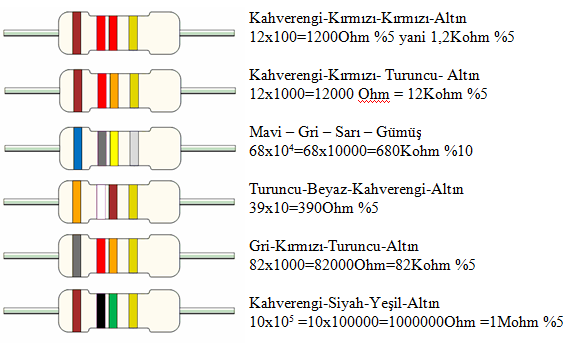

# Direnç

Dirençler devrelerimizde aşırı akımı önlemek için, voltajı değiştirmek için kullanılabilirler. Kullanım alanları sınırsızdır ve olmazsa olmazdır.

Dirençlerin üzerinde hangi ohm olduğunu gösteren renkler vardır.

Bu renkler sırasıyla,

| Renk | 1. band | 2. band | 3.band (çarpan) | 4.band (tolerans) |
| -- | -- | -- | -- | -- |
| Siyah | 0 | 0 | 10^0 | - |  
| Kahverengi | 1 | 1 | 10^1 | +1% |  
| Kırmızı | 2 | 2 | 10^2 | +2% |  
| Turuncu | 3 | 3 | 10^3 | - |  
| Sarı | 4 | 4 | 10^4 | - |  
| Yeşil | 5 | 5 | 10^5 | +0.5% |  
| Mavi | 6 | 6 | 10^6 | +0.25% |  
| Mor | 7 | 7 | 10^7 | +0.1% |  
| Gri | 8 | 8 | 10^8 | +0.05% |  
| Beyaz | 9 | 9 | 10^9 | - |  
| Altın |  |  | 10^-1 | +5% |  
| Gümüş |  |  | 10^-2 | +10% |  

Ezberleme tekniği: **sokakta sayamam gibi ama görürüm **

### Nasıl Yani? :O

Şimdi panpa sana 4 renk veriliyo. ilk 2 bandı okuyosun diyelimki mor ve kırmızıydı bu demektir ki **72** sonraki 2 bandta kırmızı ve mavi olsun buda o direcin değerini **72 x 10^2 +2%** yapar özetle **7.2kohm +2%** olur

